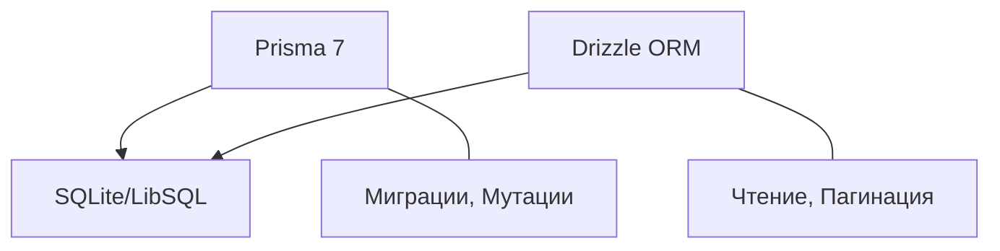

# Архитектура проекта

## Обзор

LIMS DNA Lab Journal — веб-приложение на Next.js 16 (App Router) для управления лабораторным журналом. Используется гибридный ORM-стек (Prisma + Drizzle), серверная пагинация, PWA-поддержка и аудит действий по стандартам GLP.

## Структура проекта

### `/app` — Next.js App Router

Страницы, API-маршруты и Server Actions.

| Путь | Назначение |
| :--- | :--- |
| `page.tsx` | Главная (redirect → журнал) |
| `layout.tsx` | Root layout (шрифты, metadata, провайдеры) |
| `globals.css` | CSS-переменные, base-стили, компоненты Tailwind |
| `theme.css` | MD3 токены (цвета, motion, shape) |
| `utilities.css` | MD3 утилиты (elevations, typography) |
| `animations.css` | Keyframes и View Transitions |
| `login/page.tsx` | Страница авторизации (Hiddify Token) |
| `admin/page.tsx` | Панель администрирования пользователей |
| `admin/audit/` | Журнал аудита действий |
| `actions/theme.ts` | Server Action для темы |
| `global-error.tsx` | Глобальный обработчик ошибок |
| `not-found.tsx` | Страница 404 |

### `/app/api` — REST API

| Route | Методы | Описание |
| :--- | :--- | :--- |
| `specimens/` | GET POST PUT DELETE | CRUD проб (Drizzle read, Prisma write) |
| `pcr/` | POST | Создание ПЦР-попытки |
| `pcr/batch/` | POST | Массовая ПЦР |
| `import/` | POST | Импорт из Excel |
| `export/db/` | GET | Экспорт базы |
| `history/` | GET | История изменений пробы |
| `auth/[...nextauth]/` | * | NextAuth endpoints |
| `users/` | GET POST PUT | Управление пользователями |
| `users/bulk/` | POST | Массовый импорт пользователей |
| `audit/` | GET | Аудит-лог |
| `presence/` | POST | Онлайн-присутствие |
| `backup/download/` | GET | Скачивание бэкапа |
| `upload/feedback/` | POST | Загрузка обратной связи |
| `health/` | GET | Healthcheck |
| `ota/` | GET | OTA-обновления |

### `/components` — React-компоненты

Организованы в 5 категорий, каждая имеет barrel-экспорт (`index.ts`):

| Директория | Назначение | Примеры |
| :--- | :--- | :--- |
| `features/` | Feature-компоненты | `SpecimenTable`, `QuickFilterBar`, `DevOverlay` |
| `ui/` | UI-примитивы | `Button`, `Card`, `FAB`, `TextField`, `AnimatedFlask` |
| `modals/` | Модальные окна | `AddSpecimenModal`, `EditSpecimenModal`, `PCRModal` |
| `layout/` | Layout-провайдеры | `Providers`, `ThemeProvider`, `QueryProvider` |
| `pages/` | Страничные контейнеры | `JournalPageContent`, `AdminPageContent` |

### `/hooks` — React-хуки

Barrel-экспорт через `hooks/index.ts`.

| Хук | Описание |
| :--- | :--- |
| `useJournalPage` | Оркестратор журнала (state, CRUD, ПЦР, пагинация) |
| `useAdminPage` | Логика страницы администрирования |
| `useDebounce` | Debounce-хук для поиска |
| `usePullToRefresh` | Pull-to-Refresh (мобильное) |
| `usePwaInstall` | PWA install prompt |

### `/lib` — Бизнес-логика

| Директория | Назначение |
| :--- | :--- |
| `db/drizzle/` | Инициализация Drizzle, схема (LibSQL) |
| `db/prisma/` | Инициализация Prisma, аудит-логирование |
| `auth/` | NextAuth config (Hiddify Token + Legacy Password) |
| `security/` | Валидация, Rate Limiting, Security Headers, криптография |
| `excel/` | Импорт из Excel (парсеры ячеек/строк/листов, AI, маппинг) |
| `api/` | API-клиент (fetch + retry), shared helpers |
| `utils/` | Утилиты (`cn`, cache, export, favorites) |
| `animations/` | Физический движок жидкости (SVG) |
| `bio-analytics/` | Детекция выбросов в данных |
| `shims/` | Полифилы и shim-файлы |

### `/scripts` — Скрипты

Организованы по категориям:

| Группа | Назначение |
| :--- | :--- |
| `audit/` | Аудит безопасности, ERD, QA, сбор логов |
| `ci/` | GitHub CI, статус, мониторинг |
| `db/` | Импорт, бэкап, сидинг, анализ Excel |
| `dev/` | Auth CLI, meta-sync, отладка |
| `setup/` | Установка, генерация PWA-иконок |
| `utils/` | Версионирование, рефакторинг, OTA |

### `/tests` — Тесты

| Директория | Описание |
| :--- | :--- |
| `e2e/` | Playwright E2E-тесты |
| `unit/` | Vitest unit-тесты |
| `integration/` | Интеграционные тесты API |

### Прочие файлы

| Путь | Описание |
| :--- | :--- |
| `prisma/schema.prisma` | Prisma Schema (8 моделей) |
| `prisma/migrations/` | SQL-миграции |
| `types/index.ts` | Глобальные TypeScript-типы |
| `proxy.ts` | Dev-прокси (замена middleware.ts) |
| `data/` | Исходные данные (Excel, дампы) |
| `public/` | Статика (иконки, manifest, service worker) |

## Слой данных: Hybrid Persistence

Ключевое архитектурное решение — использование двух ORM параллельно:



- **Prisma**: определение схемы (`schema.prisma`), миграции, сложные мутации (CREATE, UPDATE, DELETE)
- **Drizzle**: чтение данных на hot path, серверная пагинация с фильтрацией, аналитические запросы

## Конвенции кода

### Именование файлов

| Тип | Конвенция | Пример |
| :--- | :--- | :--- |
| Компоненты | PascalCase | `SpecimenTable.tsx` |
| Хуки | camelCase | `useDebounce.ts` |
| Утилиты | kebab-case | `api-client.ts` |
| Тесты | `*.test.ts`, `*.spec.ts` | `journal.spec.ts` |

### Организация импортов

1. React-импорты
2. Сторонние библиотеки
3. Локальные импорты (компоненты → хуки → утилиты → типы)

Barrel-экспорты позволяют использовать короткие пути:

```typescript
import { SpecimenTable, QuickFilterBar } from '@/components/features'
import { useJournalPage, useDebounce } from '@/hooks'
import { cn, cache } from '@/lib/utils'
```

### Принципы компонентов

- Функциональные компоненты с хуками
- Композиция вместо наследования
- Single Responsibility
- CVA (`class-variance-authority`) для вариантов стилей

## Связанные документы

- [DATABASE.md](DATABASE.md) — схема базы данных
- [SETUP.md](SETUP.md) — руководство по установке
