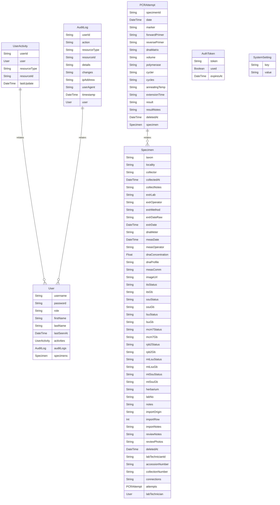

# Архитектура БД

Этот файл генерируется автоматически.

```mermaid
erDiagram
    User {
        String username
        String password
        String role
        String firstName
        String lastName
        DateTime lastSeenAt
        UserActivity activities
        AuditLog auditLogs
        Specimen specimens
    }
    UserActivity {
        String userId
        User user
        String resourceType
        String resourceId
        DateTime lastUpdate
    }
    UserActivity ||--o{ User : "relates"
    Specimen {
        String taxon
        String locality
        String collector
        DateTime collectedAt
        String collectNotes
        String extrLab
        String extrOperator
        String extrMethod
        String extrDateRaw
        DateTime extrDate
        String dnaMeter
        DateTime measDate
        String measOperator
        Float dnaConcentration
        String dnaProfile
        String measComm
        String imageUrl
        String itsStatus
        String itsGb
        String ssuStatus
        String ssuGb
        String lsuStatus
        String lsuGb
        String mcm7Status
        String mcm7Gb
        String rpb2Status
        String rpb2Gb
        String mtLsuStatus
        String mtLsuGb
        String mtSsuStatus
        String mtSsuGb
        String herbarium
        String labNo
        String notes
        String importOrigin
        Int importRow
        String importNotes
        String reviewNotes
        String reviewPhotos
        DateTime deletedAt
        String labTechnicianId
        String accessionNumber
        String collectionNumber
        String connections
        PCRAttempt attempts
        User labTechnician
    }
    PCRAttempt {
        String specimenId
        DateTime date
        String marker
        String forwardPrimer
        String reversePrimer
        String dnaMatrix
        String volume
        String polymerase
        String cycler
        String cycles
        String annealingTemp
        String extensionTime
        String result
        String resultNotes
        DateTime deletedAt
        Specimen specimen
    }
    PCRAttempt ||--o{ Specimen : "relates"
    AuditLog {
        String userId
        String action
        String resourceType
        String resourceId
        String details
        String changes
        String ipAddress
        String userAgent
        DateTime timestamp
        User user
    }
    AuditLog ||--o{ User : "relates"
    AuthToken {
        String token
        Boolean used
        DateTime expiresAt
    }
    SystemSetting {
        String key
        String value
    }
```
