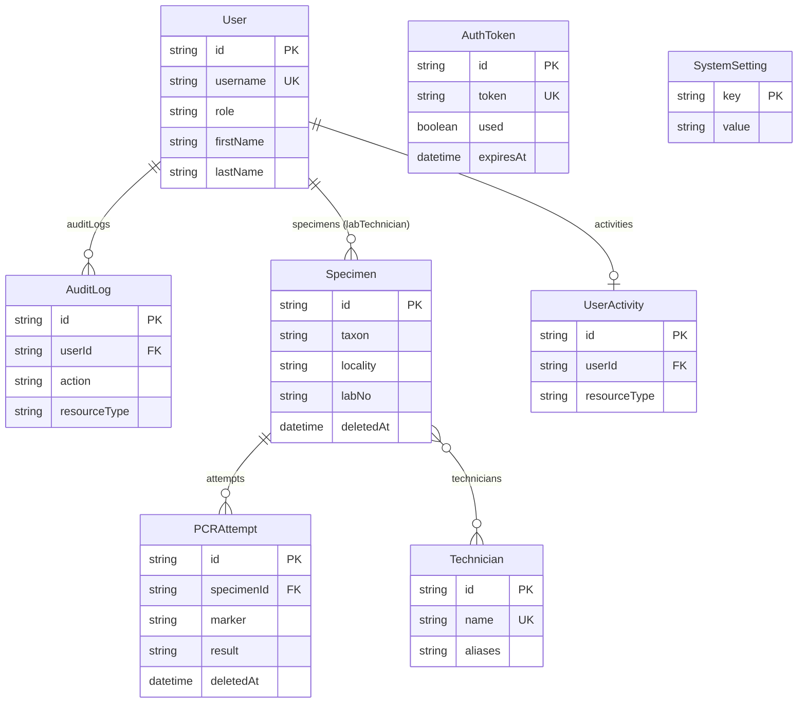

# Схема базы данных

## Обзор

Проект использует SQLite (LibSQL) с гибридным ORM-стеком: **Prisma** (определение схемы, миграции) и **Drizzle ORM** (чтение, пагинация). Схема охватывает учёт проб, ПЦР-попыток, пользователей, аудит действий и авторизацию.

Источник истины — [`prisma/schema.prisma`](../prisma/schema.prisma).

## Модели

### User

Пользователь системы с авторизацией и ролями.

| Поле | Тип | Описание |
| :--- | :--- | :--- |
| `id` | String (UUID) | Первичный ключ |
| `username` | String (unique) | Имя пользователя для входа |
| `password` | String | Хеш пароля (bcrypt) |
| `role` | String | Роль: `ADMIN`, `EDITOR` (по умолчанию) |
| `firstName` | String? | Имя |
| `lastName` | String? | Фамилия |
| `lastSeenAt` | DateTime? | Последний вход |
| `createdAt` | DateTime | Дата создания аккаунта |

**Связи**: `auditLogs` → AuditLog[], `specimens` → Specimen[], `activities` → UserActivity?

---

### Technician

Лаборант/техник. Отдельная модель для маппинга имён при импорте из Excel.

| Поле | Тип | Описание |
| :--- | :--- | :--- |
| `id` | String (UUID) | Первичный ключ |
| `name` | String (unique) | Имя техника |
| `aliases` | String? | Альтернативные написания (для маппинга) |
| `createdAt` | DateTime | Дата создания |

**Связи**: `specimens` → Specimen[] (many-to-many)

---

### UserActivity

Отслеживание текущей активности пользователя (присутствие).

| Поле | Тип | Описание |
| :--- | :--- | :--- |
| `id` | String (UUID) | Первичный ключ |
| `userId` | String (unique) | FK → User |
| `resourceType` | String? | Тип ресурса |
| `resourceId` | String? | ID ресурса |
| `lastUpdate` | DateTime | Время обновления |

**Индексы**: `[resourceType, resourceId]`

---

### Specimen

Биологическая проба — центральная сущность системы.

| Поле | Тип | Описание |
| :--- | :--- | :--- |
| `id` | String (UUID) | Первичный ключ |
| `taxon` | String? | Таксономическая классификация |
| `locality` | String? | Место сбора |
| `collector` | String? | Сборщик |
| `collectedAt` | DateTime? | Дата сбора |
| `collectNotes` | String? | Заметки о сборе |
| `herbarium` | String? | Гербарий |
| `labNo` | String? | Лабораторный номер |
| `accessionNumber` | String? | Инвентарный номер |
| `collectionNumber` | String? | Номер коллекции |
| `connections` | String? | Связи с другими пробами |
| **Экстракция** | | |
| `extrLab` | String? | Лаборатория экстракции |
| `extrOperator` | String? | Оператор экстракции |
| `extrMethod` | String? | Метод экстракции |
| `extrDateRaw` | String? | Дата экстракции (сырая строка) |
| `extrDate` | DateTime? | Дата экстракции (разобранная) |
| **Измерение ДНК** | | |
| `dnaMeter` | String? | Прибор измерения ДНК |
| `measDate` | DateTime? | Дата измерения |
| `measOperator` | String? | Оператор измерения |
| `dnaConcentration` | Float? | Концентрация ДНК |
| `dnaProfile` | String? | Профиль ДНК |
| `measComm` | String? | Комментарий к измерению |
| **Секвенирование** | | |
| `itsStatus` / `itsGb` | String? | ITS: статус / GenBank accession |
| `ssuStatus` / `ssuGb` | String? | SSU: статус / accession |
| `lsuStatus` / `lsuGb` | String? | LSU: статус / accession |
| `mcm7Status` / `mcm7Gb` | String? | MCM7: статус / accession |
| `rpb2Status` / `rpb2Gb` | String? | RPB2: статус / accession |
| `mtLsuStatus` / `mtLsuGb` | String? | mtLSU: статус / accession |
| `mtSsuStatus` / `mtSsuGb` | String? | mtSSU: статус / accession |
| **Мета** | | |
| `imageUrl` | String? | URL изображения |
| `notes` | String? | Общие заметки |
| `reviewNotes` | String? | Заметки рецензента |
| `reviewPhotos` | String? | Фотографии для рецензии |
| `importOrigin` | String? | Источник импорта |
| `importRow` | Int? | Номер строки в файле импорта |
| `importNotes` | String? | Заметки импорта |
| `addedBy` | String? | Кем добавлена |
| `labTechnicianId` | String? | FK → User (лаборант) |
| `deletedAt` | DateTime? | Soft delete |
| `createdAt` | DateTime | Дата создания |
| `updatedAt` | DateTime | Дата обновления |

**Связи**: `attempts` → PCRAttempt[], `labTechnician` → User?, `technicians` → Technician[] (many-to-many)

**Индексы**: `[deletedAt]`

---

### PCRAttempt

Попытка ПЦР-амплификации.

| Поле | Тип | Описание |
| :--- | :--- | :--- |
| `id` | String (UUID) | Первичный ключ |
| `specimenId` | String | FK → Specimen |
| `date` | DateTime | Дата попытки |
| `marker` | String? | Генетический маркер |
| `forwardPrimer` | String? | Прямой праймер |
| `reversePrimer` | String? | Обратный праймер |
| `dnaMatrix` | String? | ДНК-матрица |
| `volume` | String? | Объём реакции |
| `polymerase` | String? | ДНК-полимераза |
| `cycler` | String? | ПЦР-амплификатор |
| `cycles` | String? | Количество циклов |
| `annealingTemp` | String? | Температура отжига |
| `extensionTime` | String? | Время элонгации |
| `result` | String | Результат: `SUCCESS`, `FAILED`, `WEAK`, `REPEAT` |
| `resultNotes` | String? | Заметки к результату |
| `addedBy` | String? | Кем добавлена |
| `deletedAt` | DateTime? | Soft delete |
| `createdAt` | DateTime | Дата создания |

**Связи**: `specimen` → Specimen (onDelete: Cascade)

**Индексы**: `[specimenId]`, `[marker]`, `[deletedAt]`

---

### AuditLog

Журнал аудита действий (соответствие GLP).

| Поле | Тип | Описание |
| :--- | :--- | :--- |
| `id` | String (UUID) | Первичный ключ |
| `userId` | String | FK → User |
| `action` | String | Действие: `CREATE_SPECIMEN`, `UPDATE_SPECIMEN`, `DELETE_SPECIMEN`... |
| `resourceType` | String | Тип ресурса: `SPECIMEN`, `PCR_ATTEMPT`, `USER`... |
| `resourceId` | String? | ID ресурса |
| `details` | String? | Подробности (JSON) |
| `changes` | String? | Изменения before/after (JSON) |
| `ipAddress` | String? | IP-адрес |
| `userAgent` | String? | User Agent |
| `timestamp` | DateTime | Время действия |

**Связи**: `user` → User

**Индексы**: `[userId]`, `[timestamp]`, `[resourceType, resourceId]`

---

### AuthToken

Одноразовый токен авторизации (Hiddify-стиль).

| Поле | Тип | Описание |
| :--- | :--- | :--- |
| `id` | String (UUID) | Первичный ключ |
| `token` | String (unique) | Значение токена |
| `used` | Boolean | Использован (по умолчанию `false`) |
| `expiresAt` | DateTime | Срок действия |
| `createdAt` | DateTime | Дата создания |

---

### SystemSetting

Системные настройки (key-value).

| Поле | Тип | Описание |
| :--- | :--- | :--- |
| `key` | String | Ключ (первичный ключ) |
| `value` | String | Значение |
| `updatedAt` | DateTime | Дата обновления |

## ER-диаграмма



## Проектные решения

- **UUID Primary Keys** — глобальная уникальность, защита от перебора
- **Soft Delete** — `deletedAt` в `Specimen` и `PCRAttempt` для безопасного удаления с возможностью восстановления
- **Cascading Deletes** — удаление пробы каскадно удаляет PCRAttempt
- **Отслеживание импорта** — поля `importOrigin`, `importRow`, `importNotes` для трассировки происхождения данных
- **Аудит по GLP** — все действия логируются с деталями изменений (before/after)
- **Маркерные статусы** — 7 маркеров секвенирования (ITS, SSU, LSU, MCM7, RPB2, mtLSU, mtSSU) со статусами и GenBank accession

## Миграции

```bash
# Создание новой миграции
npx prisma migrate dev --name <имя-миграции>

# Применение в production
npx prisma migrate deploy

# Визуальный просмотр базы
npm run prisma:studio
```
